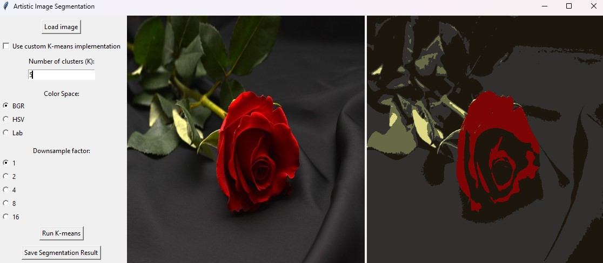

# Artistic Image Segmentation

This Python application performs image segmentation using the k-means algorithm. It allows you to split an image into visually homogeneous regions based on color similarity, which can be useful for artistic color reduction, image compression, or feature extraction.

## Project Overview

The application provides an intuitive GUI that lets you:
- Load an image (JPG or PNG).
- Specify the number of clusters (K) for segmentation.
- Choose a color space (BGR, HSV, or Lab) for processing.
- Optionally apply downsampling to reduce the image resolution before segmentation.
- Run the k-means segmentation (using either a custom implementation or OpenCV’s optimized function).
- Save the segmented image to a file.



## Requirements

- Python 3.x
- Tkinter
- OpenCV (opencv-python)
- NumPy
- Pillow

Install the required packages using:
```bash
pip install -r requirements.txt
